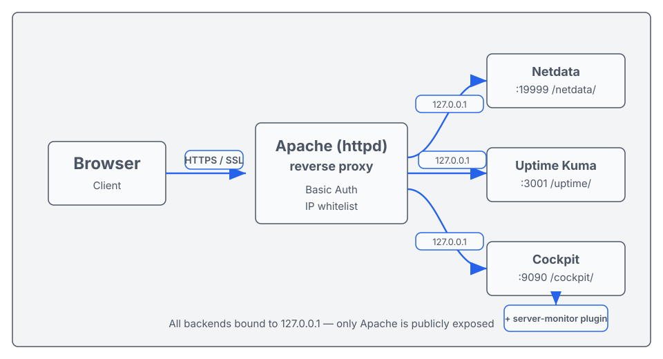
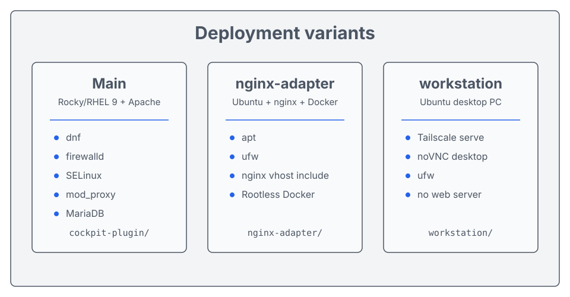

# server-monitor

[English](#english-summary) · [한국어](#한국어)

서버 관제 자동 배포 도구 — **Netdata + Uptime Kuma + Cockpit** + 자체 Cockpit 플러그인 (`server-monitor`) 으로 단일 서버 또는 여러 서버를 통합 관제.



---

## English summary

Self-hostable server monitoring stack that pairs three best-in-class tools with a custom Cockpit plugin:

- **Netdata** (`/netdata/`) — real-time metrics: CPU, RAM, disk, network, MariaDB, Apache / nginx.
- **Uptime Kuma** (`/uptime/`) — synthetic checks: HTTP, ping, TCP, SSL-expiry, push.
- **Cockpit** (`/cockpit/`) — system management UI (services, logs, storage, accounts) + this repo's plugin: **Sites / IP Rules / Database / Accounts / Logs / Firewall / Services / Management / Logs**.

Designed primary for **Apache on Rocky/RHEL 9** with adapters for **nginx on Ubuntu** (`nginx-adapter/`) and **Ubuntu workstation** (`workstation/`). Single `.env` drives the whole install. macOS porting notes are in [`docs/PORTING_MACOS.md`](docs/PORTING_MACOS.md).

```bash
git clone https://github.com/your-org/server-monitor-deploy.git
cd server-monitor-deploy
cp env.example .env && $EDITOR .env
sudo bash scripts/install.sh
```

---

## 한국어

### 빠른 시작 (메인 — Rocky/RHEL 9 + Apache)

```bash
git clone https://github.com/your-org/server-monitor-deploy.git
cd server-monitor-deploy
cp env.example .env
vi .env                        # 서버 정보 / 비밀번호 / 도메인 / SSL 이메일 입력
sudo bash scripts/install.sh   # 자동 설치
```

### 다른 환경 (어댑터)

| 환경 | 디렉토리 | 핵심 차이 |
|------|----------|-----------|
| Rocky/RHEL 9 + Apache | (메인) | 기본 가정. `dnf`, `firewalld`, `SELinux`, Apache mod_proxy |
| Ubuntu + nginx + Docker | [`nginx-adapter/`](nginx-adapter/) | `apt`, `ufw`, nginx vhost include 모델, Rootless Docker 친화 |
| Ubuntu 워크스테이션 (개발/사무용 PC) | [`workstation/`](workstation/) | Desktop(VNC) 메뉴 포함, Tailscale Funnel/Serve 노출 패턴 |
| macOS (포팅 안내) | [`docs/PORTING_MACOS.md`](docs/PORTING_MACOS.md) | Cockpit 부재, launchd, pf, brew. **포팅 가이드만 제공** |



### 구성 요소

| 서비스 | 경로 | 역할 |
|--------|------|------|
| Netdata | `/netdata/` | CPU·RAM·Disk·Network·MariaDB·Apache 실시간 메트릭 |
| Uptime Kuma | `/uptime/` | HTTP/TCP/Ping/SSL 만료 체크 + 알림 |
| Cockpit | `/cockpit/` | 시스템 관리, 로그, 보안, 스토리지 |
| **server-monitor plugin** | `/cockpit/server-monitor` | Sites/IP Rules/Database/Accounts/Logs/Firewall/Services/Management 통합 운영 콘솔 |

### 디렉토리 구조

```
server-monitor-deploy/
├── env.example                 # 환경변수 템플릿 (비밀번호는 .env 에만)
├── config/
│   ├── templates/              # 설정 템플릿 ({{변수}} 자동 치환)
│   └── active/                 # 적용 예시 (민감정보 제거됨)
├── sql/                        # DB 계정·권한 SQL
├── scripts/
│   ├── install.sh              # 자동 설치 (메인)
│   ├── uninstall.sh            # 제거
│   ├── server-monitor-iprule   # IP Rules sudo wrapper (Apache 어댑터)
│   └── server-monitor-db       # DB 관리 sudo wrapper
├── cockpit-plugin/             # Cockpit 플러그인 (Apache 메인)
├── www/                        # 랜딩 페이지 (HTML/CSS)
├── docs/
│   ├── setup-guide.md          # 상세 구축 가이드
│   ├── PORTING_MACOS.md        # macOS 포팅 안내
│   └── REPLACEMENTS.md         # 외부 배포 시 식별자 매핑 표
├── nginx-adapter/              # Ubuntu/nginx 환경 어댑터 (Apache 모델의 변형)
└── workstation/                # Ubuntu 워크스테이션 환경 (Desktop/VNC/Tailscale 추가)
```

### `.env` 필수 항목

| 변수 | 설명 |
|------|------|
| `SERVER_DOMAIN` | 모니터링 도메인 (예: `monitor.example.com`) |
| `SERVER_IP` | 서버 공인 IP |
| `MONITOR_PASS` | Linux `monitor` 계정 비밀번호 |
| `DB_ROOT_PASS` | MariaDB root 비밀번호 |
| `DB_MONITOR_PASS` | MariaDB 읽기 전용 모니터 계정 비밀번호 |
| `DB_NAMES` | 모니터링 대상 DB 명 (쉼표 구분) |
| `HTPASSWD_USER` / `HTPASSWD_PASS` | Apache Basic Auth |
| `SSL_EMAIL` | Let's Encrypt 발급 이메일 |

> `.env` 는 `.gitignore` 로 추적 제외됨. 절대 커밋 금지.

### 요구사항 (메인 환경)

- Rocky Linux 9.x / CentOS Stream 9 / RHEL 9 동급
- Apache httpd 2.4 (mod_proxy, mod_proxy_wstunnel)
- MariaDB 10.x 이상
- Node.js 18+ / PM2 (Uptime Kuma 호스팅용)
- certbot (Let's Encrypt SSL)

### 보안 권장사항

- Cockpit / Netdata / Uptime Kuma 경로는 **Basic Auth + IP 화이트리스트** 필수. `config/templates/` 의 vhost 템플릿이 기본으로 제공.
- `server-monitor` 플러그인의 destructive 액션(서비스 stop, IP Rule 변경)은 모달 타입드 확인 요구.
- 첫 운영 전 [docs/setup-guide.md](docs/setup-guide.md) 의 보안 체크리스트 통과.

### 라이선스

[MIT License](LICENSE)

### 관련 문서

- [docs/setup-guide.md](docs/setup-guide.md) — 상세 구축 가이드
- [docs/PORTING_MACOS.md](docs/PORTING_MACOS.md) — macOS 포팅 안내 (Cockpit 부재 등)
- [docs/REPLACEMENTS.md](docs/REPLACEMENTS.md) — 외부 배포 시 사용된 식별자 매핑 표
- [SECURITY.md](SECURITY.md) — 취약점 신고 채널

### 기여

PR / 이슈 환영. 보안 취약점은 [SECURITY.md](SECURITY.md) 의 비공개 채널로 먼저 알려 주세요.
